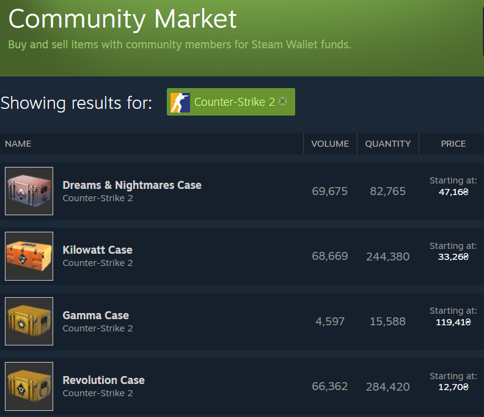
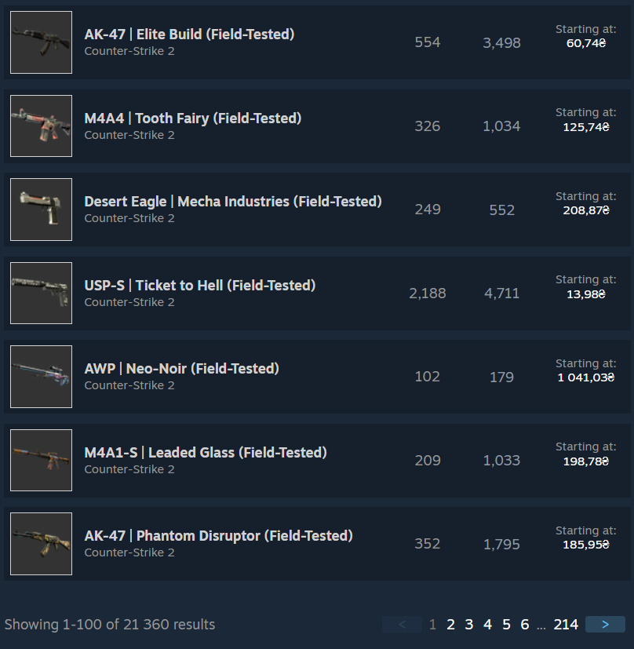

# Notice

This repository is archived. The changes to the new version are enough to make it easier and more convenient for me to develop a browser extension

# Steam Market Toolbox

A set of utilities (or consider it as a single script) that enhances various components of the Steam Community Market

## How to install

1. Install any **monkey* extension for your browser.
   - [Violentmonkey](https://violentmonkey.github.io/)
   - [Tampermonkey](https://www.tampermonkey.net/)
   - [Greasemonkey](https://www.greasespot.net/)

2. Install [this](https://github.com/SeRi0uS007/SteamMarketToolbox/raw/master/steammarkettoolbox.user.js) userscript.

## Features

- Expanding the lots list on one page to 100 items;
- Displaying the 24 hours volume on a lot row;
- Displaying all marketable apps in right menu for */market/search*;
- Displaying prices and online statuses and filter them.

> Warning. This is a beta release. Features are subject to change.

## TODO

- Configurable volume (from 1 hour to 1 week);
- Configuration window;
- Localization;
- Displaying (selecting) the currency for the lot page;
- Bugs???.

> You can propose any changes or ideas in issues.

## Screenshots

https://steamcommunity.com/market/search

## License
[MIT](LICENSE.txt)